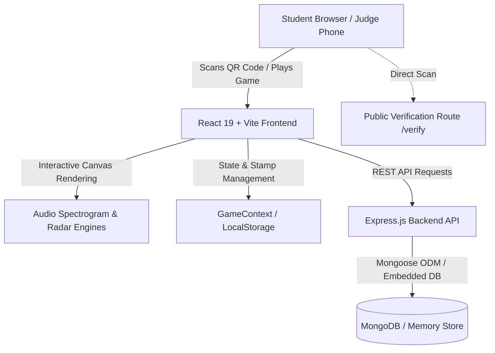

# 🛡️ DIGI RAKSHA (డిజి రక్ష / डिजी रक्षा)
### *Next-Generation Gamified Cyber Safety Simulation Challenge for School Students*

[](https://digi-raksha-six.vercel.app)
[](https://digi-raksha-six.vercel.app/verify)
[](https://react.dev)
[](https://www.typescriptlang.org/)
[](https://nodejs.org)
[](https://ieeessit.org/)

---

## 🌐 Live URLs & Quick Links

- **🚀 Live Application**: [https://digi-raksha-six.vercel.app](https://digi-raksha-six.vercel.app)
- **🪪 Public QR Verification Portal (Judge Mobile Test)**: [https://digi-raksha-six.vercel.app/verify](https://digi-raksha-six.vercel.app/verify)
- **🎙️ Deepfake Audio Forensics Lab**: [https://digi-raksha-six.vercel.app/deepfake-lab](https://digi-raksha-six.vercel.app/deepfake-lab)
- **📡 National Threat Radar SOC**: [https://digi-raksha-six.vercel.app/threat-radar](https://digi-raksha-six.vercel.app/threat-radar)
- **📱 CyberPhone Sandbox Simulator**: [https://digi-raksha-six.vercel.app/phone-simulator](https://digi-raksha-six.vercel.app/phone-simulator)
- **🕵️‍♂️ Digital Safety Escape Room**: [https://digi-raksha-six.vercel.app/escape-room](https://digi-raksha-six.vercel.app/escape-room)

---

## 🎯 Problem Statement & Purpose

With over **150 million Indian students** accessing smartphones for digital education, homework, and gaming, cybercriminals are increasingly exploiting youthful curiosity and fear through:
1. **Digital Arrest Syndicates**: Scammers impersonating CBI or Delhi Police officers over Skype/WhatsApp video calls.
2. **AI Voice Clone Distress Calls**: Cloned audio clips from social media reels demanding emergency ransom.
3. **Predatory APK Sideloads**: Flashlight or scholarship apps stealing SMS OTPs and contact books.
4. **UPI Merchant QR Tampering & Debit Traps**: Fake payment requests disguised as cashbacks.

Traditional classroom lectures and PDF handbooks fail because they are **passive**. **DIGI RAKSHA** solves this crisis through **active simulation**: students make real-time decisions inside simulated smartphone interfaces, inspect audio waveforms, defuse screen-sharing takeovers, and navigate threat war rooms.

---

## 🏆 Award-Winning Hackathon Features

### 1. 🪪 Printable Holographic Cadet ID Card with Scannable QR Verification
* **The "Hackathon Winning" Moment**: You invite judges to pull out their personal smartphones and scan the on-screen QR code.
* **Instant Public Verification (`/verify`)**: Opens an unauthenticated public cryptographic credential page showing:
  - Official Cyber Defense Agent ID (`STUDENT-VIK-9902`)
  - Cryptographic Verification Seal with SHA-256 Hash
  - Student Rank, School, and Verified Competency Stamps
* **3D Perspective Holographic Badge (`/id-card`)**: Built with CSS 3D transforms (`rotate-y-180`, iridescent ribbon sheen, and flip animations).
* **1-Click Print Badge**: Optimized with `@media print` stylesheets so students can print an official wallet-sized badge for school.

### 2. 🎙️ AI Voice Clone & Deepfake Audio Forensics Lab (`/deepfake-lab`)
* **Real-Time Dual-Band FFT Canvas Spectrogram**: Plots 0–5.0 kHz audio frequencies at 60 FPS.
* **3 Forensic Filter Overlays**:
  - **3.2 kHz Pitch Anomaly Lens**: Detects high-frequency vocoder diffusion spikes characteristic of neural voice synthesis (ElevenLabs/Bark models).
  - **Cadence & Breath Detector**: Audits natural biological diaphragmatic inhalations and cadence variance.
  - **Noise Floor Mismatch**: Detects sterile digital silence (`-98 dB`) versus natural acoustic room reverberation (`-46 dB`).
* **4 Realistic Indian Threat Scenarios**:
  1. *Digital Arrest Call* (CBI Inspector impersonation)
  2. *Emergency Family Kidnap Extortion* (Voice clone of younger sibling)
  3. *School Principal Gift Card Trap* (Authority coercion)
  4. *Legitimate Bank Automated IVR* (Authentic transaction alert)

### 3. 🌐 Live National School Cyber Threat Radar & SOC War Room (`/threat-radar`)
* **Continuous 360° Circular Radar Sweep**: Phosphor beam rotation with decaying trail on HTML5 canvas and 125–500 KM defense range rings.
* **Regional Incident Telemetry Across Indian Tech & School Hubs**:
  - **Hyderabad**: Predatory instant loan APK sideloading requesting SMS/Contacts access.
  - **New Delhi**: Digital arrest video call syndicate.
  - **Bengaluru**: Board exam question leak Discord botnet.
  - **Mumbai**: Counterfeit school fee physical UPI QR sticker fraud.
  - **Kolkata**: Gaming token credential stealer.
* **Interactive SOC Interception Protocol**: Deploy DNS sinkholes, revoke rogue OAuth tokens, and issue CERT-In advisories.
* **Live Rolling Security Ticker & National Counter**: Dynamically tracks over 18,490+ threats neutralized across school networks.

### 4. 📱 Realistic Virtual Smartphone OS Sandbox (`/phone-simulator`)
* **Interactive Mobile Chassis**: Complete with Titanium bezel, Dynamic Island, time/battery status bar, and gesture navigation.
* **ChitChat Messenger**: Realistic chat threads with live typing indicators (`● ● ● typing...`), read receipts, and fake scholarship APK attachments.
* **AppForge Permission Auditor**: Inspect high-risk Android permissions (`READ_SMS`, `RECORD_AUDIO`, `ACCESSIBILITY_SERVICE`) and quarantine malicious packages.
* **AnyDesk Remote Screen-Sharing Trap**: Incoming scam call, rogue remote cursor takeover animation, and an emergency 15-second kill-switch.

### 5. 🕵️‍♂️ Digital Safety Escape Room (`/escape-room`)
* **5-Stage Ransomware Lockdown**: Decode entropy passwords, inspect fake scholarship links, audit malicious QR payment requests, and defend OTPs.
* **3-Lives (Hearts) Health System**: Heart-loss sound synthesizer, visual screen shake on errors, and terminal lockout fail-safes.
* **Interactive Password Strength Meter**: Live entropy evaluation testing length, casing, numbers, and symbols with estimated crack times.

---

## 🎮 Core Training Modules

| Module | Route | Cyber Defense Skill Trained |
| :--- | :--- | :--- |
| **Phishing Hunter** | `/mission/phishing` | Analyzing deceptive sender headers, spoofed domains, and credential traps |
| **OTP Defender** | `/mission/otp` | Protecting SMS 2FA codes and resisting urgent social engineering calls |
| **Vishing Detective** | `/mission/vishing` | Identifying telecom impersonation and activating the national 1930 fraud alert |
| **QR Detective** | `/mission/upi` | The Golden Rule of UPI: scanning QR codes and entering PINs strictly debits money |
| **Cyber City Map** | `/city-map` | Isometric 3D city grid with localized safety checkpoints across school and community zones |
| **Safety Passport** | `/passport` | Collecting rubber stamps and stars for every successfully completed mission |
| **Safety Pledge** | `/pledge` | Interactive digital signature canvas generating verified student safety certificates |
| **Avatar Shop** | `/avatar` | Cadet customization unlocking tactical visors, drone companions, and cyber armor |
| **AI Drone Assistant** | Floating Widget | Embedded AI safety drone offering contextual voice debriefs and security tips |

---

## 🏗️ Architecture & Technology Stack



### Frontend
- **Framework**: React 19 + TypeScript (Strict Mode)
- **Bundler & Dev Server**: Vite 8
- **Styling**: Tailwind CSS v4 + Vanilla CSS animations
- **Motion & Visuals**: Framer Motion, HTML5 2D Canvas (FFT Spectrogram, Circular Polar Radar, Signature Pad)
- **Icons & UI**: Lucide React, Canvas Confetti, Recharts

### Backend & Storage
- **Runtime**: Node.js (ES Modules)
- **Web Framework**: Express.js
- **Database**: MongoDB with Mongoose ODM (includes automatic `mongodb-memory-server` fallback for zero-configuration testing)
- **Authentication**: JWT (JSON Web Tokens) with role-based access control (`student`, `volunteer`, `admin`)
- **Password Security**: bcryptjs password hashing

---

## 📂 Project Directory Structure

```text
Digi Raksha/
├── frontend/
│   ├── src/
│   │   ├── components/
│   │   │   ├── Layout.tsx             # Master navigation frame with responsive header & sidebar
│   │   │   ├── Sidebar.tsx            # Cadet mission links, rank badge, and quick launch menu
│   │   │   └── RakshaAiDrone.tsx      # Interactive AI security drone assistant
│   │   ├── context/
│   │   │   └── GameContext.tsx        # Global state: XP, coins, stamps, badges, missions
│   │   ├── pages/
│   │   │   ├── CyberIdCard.tsx        # 3D Holographic Cadet ID Card & QR generation
│   │   │   ├── PublicVerify.tsx       # Unauthenticated QR verification portal for judges
│   │   │   ├── DeepfakeLab.tsx        # AI Voice Clone & Spectrogram Forensics Lab
│   │   │   ├── ThreatRadar.tsx        # Live National School Threat Radar & SOC War Room
│   │   │   ├── PhoneSimulator.tsx     # Virtual Smartphone OS Sandbox simulator
│   │   │   ├── CyberEscapeRoom.tsx    # 5-Stage ransomware escape room with 3-lives system
│   │   │   ├── Dashboard.tsx          # Mission control center, daily tips, and spin wheel
│   │   │   ├── Passport.tsx           # Safety passport with earned stamps and badges
│   │   │   ├── CyberCityMap.tsx       # Interactive city exploration map
│   │   │   ├── AvatarCustomizer.tsx   # Cadet profile customization and reward shop
│   │   │   ├── Pledge.tsx             # Digital safety pledge signature canvas
│   │   │   ├── Certificate.tsx        # Verified graduation certificate generator
│   │   │   └── AdminPanel.tsx         # Teacher and administrator analytics panel
│   │   ├── App.tsx                    # React Router configuration & AuthGuard routes
│   │   └── main.tsx                   # Vite application entry point
│   ├── package.json
│   └── vite.config.ts
├── backend/
│   ├── middleware/
│   │   └── auth.js                    # JWT token authentication and role verification
│   ├── models/
│   │   └── User.js                    # Cadet user schema (XP, rank, badges, stamps)
│   ├── routes/
│   │   ├── auth.js                    # Registration, login, and token generation
│   │   ├── game.js                    # Mission completion, stamp awards, and score sync
│   │   └── admin.js                   # School cohort management and telemetry
│   ├── server.js                      # Express server entry point & MongoDB initialization
│   └── package.json
└── README.md
```

---

## ⚡ Quick Start Guide

### Prerequisites
- **Node.js**: v18.0.0 or higher ([Download Node.js](https://nodejs.org/))
- **npm**: v9.0.0 or higher

---

### 1. Run Frontend (React + Vite)
```bash
# Navigate to frontend directory
cd frontend

# Install dependencies
npm install

# Start local development server
npm run dev
```
Open **[http://localhost:5173](http://localhost:5173)** in your browser.

---

### 2. Run Backend (Node.js + Express)
```bash
# In a new terminal, navigate to backend directory
cd backend

# Install dependencies
npm install

# Start the Express server
npm run dev
```
The backend automatically connects to MongoDB. If no external `MONGODB_URI` is provided in `.env`, it launches an embedded in-memory database automatically with zero setup required.

---

## 🎭 Role-Based Test Accounts

When logging into the system, you can use any username or test with these pre-configured roles:

| Role | Access Permissions | Default Credentials |
| :--- | :--- | :--- |
| **Student Cadet** | Full access to all missions, escape room, phone simulator, ID card, and passport | Enter any name (e.g. `Cadet Vikram`), School, and Class |
| **Volunteer** | Queue management, poster review, and score moderation | `volunteer / password` |
| **Administrator** | School-wide analytics, cohort telemetry, and mission audit logs | `admin / password` |

---

## 🎤 3-Minute Hackathon Demo Script for Judges

| Time | Action on Screen | Pitch to Judges |
| :--- | :--- | :--- |
| **0:00 - 0:45** | Open **Dashboard** & launch **Phone Sandbox** (`/phone-simulator`) | *"Judges, over 150 million Indian school students use smartphones daily. Instead of boring slides, DIGI RAKSHA puts them inside a realistic smartphone sandbox to inspect dangerous APK permissions and defuse live AnyDesk screen-sharing traps."* |
| **0:45 - 1:30** | Switch to **Deepfake Audio Lab** (`/deepfake-lab`) | *"The fastest rising scam in India today is Digital Arrest and AI Voice Cloning. Here, cadets use a real-time FFT spectrogram to detect telltale 3.2 kHz vocoder spikes and missing natural breath intervals."* |
| **1:30 - 2:15** | Open **National Threat Radar SOC** (`/threat-radar`) | *"In our National Threat Radar, cadets step into a live military SOC war room. They monitor active threat telemetry across Delhi, Mumbai, Hyderabad, and Bengaluru, deploying DNS sinkholes and neutralizing fraud rings."* |
| **2:15 - 3:00** | Open **Agent ID Card** (`/id-card`) and show QR Code | *"Finally, respected judges: please take out your mobile phones and scan this QR code right now on my screen. Notice how it instantly opens our live Vercel site to verify my student credentials with an immutable cryptographic SHA-256 hash."* |

---

## 🛡️ Partnerships & Safety Standards

- **IEEE SSIT Affiliation**: Developed aligned with educational safety guidelines of the **IEEE Society on Social Implications of Technology**.
- **National Cyber Crime Helpline**: Directly integrates and educates students on reporting cyber fraud to **1930** and **[cybercrime.gov.in](https://cybercrime.gov.in)**.
- **Data Privacy**: No biometric data or sensitive personal information is stored. Local storage sandboxing ensures complete student privacy compliance.

---

## 📜 License
Distributed under the **MIT License**. Created with pride for student digital empowerment and cyber safety education.
